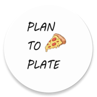

# PlanToPlate - Meal Planning Android Application

PlanToPlate is a comprehensive Android application designed to simplify your meal planning and grocery shopping process. 
With its user-friendly interface and feature-rich modules, it's your all-in-one solution for managing your meals 
and kitchen supplies efficiently.

## Table of Contents

1. [Features](#features)
2. [Installation](#installation)
3. [Getting Started](#getting-started)
4. [Modules](#modules)
    - [Shopping List](#shopping-list)
    - [Storage](#storage)
    - [Products Database](#products-database)
    - [Recipes](#recipes)
    - [Calendar](#calendar)
5. [Contributing](#contributing)
6. [License](#license)

## Features

- **Meal Planning:** Plan your meals and recipes ahead of time with an integrated calendar.
- **Shopping List:** Create and manage your shopping lists easily.
- **Product Storage:** Keep track of the products you have at home.
- **Products Database:** Access a vast database of products to choose from for your recipes and shopping lists.
- **Recipe Management:** Store and organize your favorite recipes.
- **Customizable:** Tailor your meal plans and lists to your dietary needs and preferences.

## Installation

1. Clone the repository: `git clone https://github.com/PlanToPlateWMI/Repository_of_Android_App`
2. Open the project in Android Studio.
3. Build and run the application on your Android device.

## Getting Started

- Upon installation, create an account or log in to access the full range of features.
- Start by adding products to your storage or selecting them from the database.
- Plan your meals using the calendar module.
- Create shopping lists for your planned meals.
- Explore and add recipes to your collection.
- Enjoy the convenience of organized meal planning and shopping.

## Modules

### Shopping List

The Shopping List module allows you to create and manage shopping lists. You can add items directly or choose ingredients 
from your recipes and products database. This feature ensures you never forget a crucial ingredient during your grocery shopping.

### Storage

The Storage module lets you keep track of the products you have at home. You can update quantities and quickly assess 
what you need for your recipes without having to rummage through your kitchen.

### Products Database

The Products Database module provides access to a wide range of products. You can choose items from this database when 
creating recipes or shopping lists, making it easier to find the right ingredients.

### Recipes

The Recipes module is your personal cookbook. Add and organize your favorite recipes, making them readily available 
for meal planning. You can also link recipes to your shopping lists, simplifying the process of gathering ingredients.

### Calendar

The Calendar module is your meal planner. Schedule your meals and recipes in advance, helping you stay organized 
and ensuring you have the right ingredients at the right time.

## Contributing

We welcome contributions from the community to make PlanToPlate even better. If you'd like to contribute, 
please follow our [Contributing Guidelines](CONTRIBUTING.md).

## License

This project is licensed under the Apache License - see the [LICENSE](LICENSE.md) file for details.

---

Feel free to contact us at [plantoplatemobileapp@gmail.com](mailto:plantoplatemobileapp@gmail.com) for any questions or support.

Enjoy your meal planning and cooking with PlanToPlate! 🍽️📆🛒

